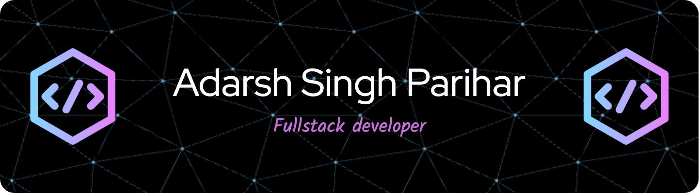

  
  
  ### Software Engineer from India | Building the Future, One Line at a Time
  
  

### 🚀 About Me
- 🔭 Passionate about creating robust and scalable applications  
- 🌱 Currently exploring **VueJs**  
- 💡 Always eager to learn new technologies  
- ⚡ Fun fact: I bring humor to coding sessions! 😄  

---

### 🛠️ Tech Stack

#### Programming Languages

  
  
  
  

#### Frontend Development

  
  
  
  
  
  

#### Backend Development

  
  
  

#### Databases

  
  
  

#### Tools & Platforms

  
  
  
  
  

---

### 📊 GitHub Stats

  
  
  
  
  

---

### 📫 Connect With Me
- 📧 Email: adarshparihar2626@gmail.com  
- 🌐 [LinkedIn](#) <!-- Add your LinkedIn profile link -->
- 🌐 [Portfolio](#) <!-- Add your portfolio website link if you have one -->

---

  <i>Happy Coding! 👨‍💻</i>

